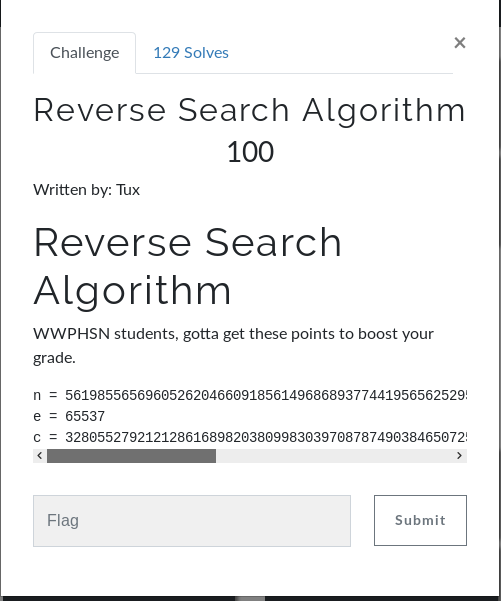

# Reverse Search Algorithm (Crypto)

## Initial Thoughts

* Basic RSA

# Walkthrough

* Use factordb.com to find p and q from n
* See [Script](scripts/apple.py) for equation breakdown and solution

## Info Links

[RSA Equation](https://simple.wikipedia.org/wiki/RSA_algorithm)
