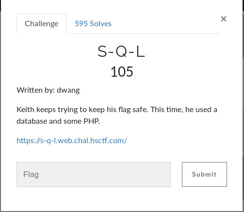

# S-Q-L (WEB)

## Initial Thoughts

* should be some form of sqli

# Walkthrough

https://sechow.com/bricks/docs/login-1.html

Entered keith as username and __' or '1'='1__ as the password. Test __' or '1'='1__ as username AND password and that also worked

	
Flag

hsctf{mysql_real_escape_string}

