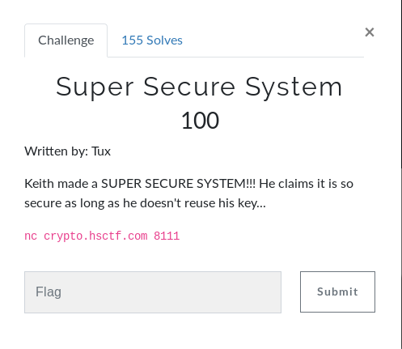
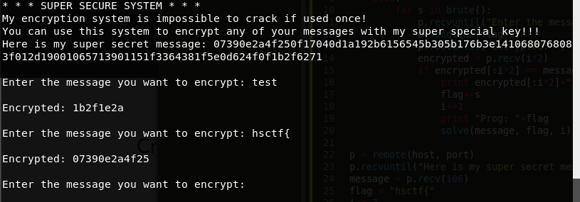

# Super Secure System (Crypto)



## Initial Thoughts

* Key CIPHER
* XOR, Substitution?
* Each letter input gives 2 digit decimal back, hex?

# Walkthrough

* My first step was to throw random strings at the program and analyze what returned. It was obvious on the second go that the flag is the key to the CIPHER as seen below

<details>
	<summary>Testing Random Stuff</summary>

</details>

* I decided to write a python script that would brute force the key one character at a time and compare the original message with the encrypted output

<details>
	<summary>Python Script</summary>
```python
#!/usr/bin/env python
from pwn import *
from brute import brute

host, port = "crypto.hsctf.com", 8111
def solve(message, flag, i):
	if "}" in flag:
		print "Flag: "+flag
	else:
		for s in brute():
			p.recvuntil("Enter the message you want to encrypt: ")
			p.sendline(flag+s)
			p.recvuntil("Encrypted: ")
			encrypted = p.recv(i*2)
			if encrypted[:i*2] == message[:i*2]:
				print encrypted[:i*2]+" : "+message[:i*2]
				flag+=s
				i+=1
				print "Prog: "+flag
				solve(message, flag, i)

p = remote(host, port)
p.recvuntil("Here is my super secret message: ")
message = p.recv(106)
flag = "hsctf{"
i = 7
solve(message, flag, i)
```

</details>