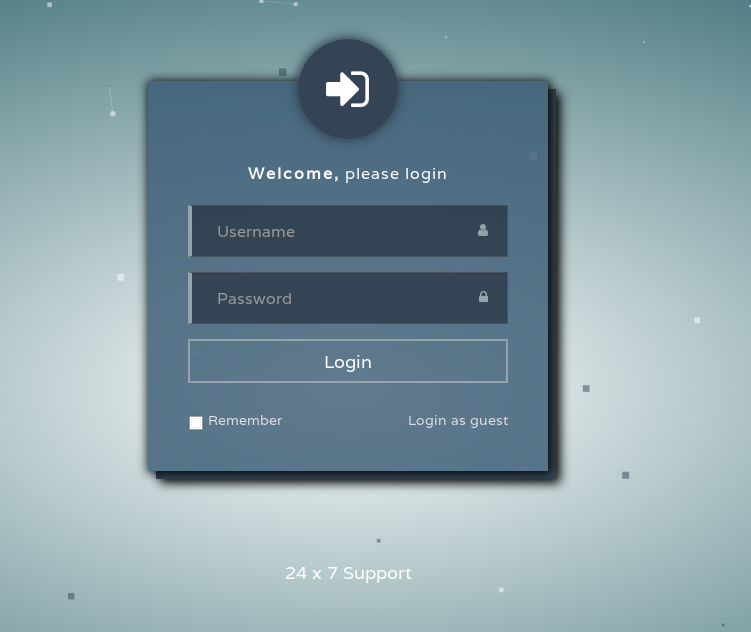
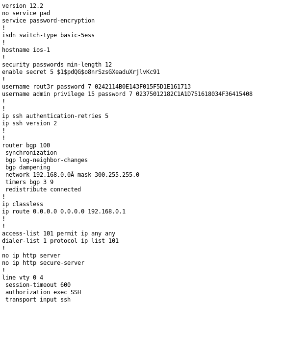
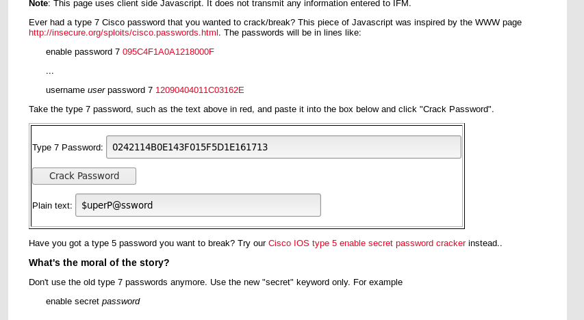

## Vulnerability Assessment

**nmap -sV 10.10.10.149**
```
Starting Nmap 7.70 ( https://nmap.org ) at 2019-11-07 11:27 EST
Nmap scan report for 10.10.10.149
Host is up (0.058s latency).
Not shown: 997 filtered ports
PORT    STATE SERVICE       VERSION
80/tcp  open  http?
135/tcp open  msrpc?
445/tcp open  microsoft-ds?

Service detection performed. Please report any incorrect results at https://nmap.org/submit/ .
Nmap done: 1 IP address (1 host up) scanned in 33.50 seconds
```
Checking http through the browswer we get a website login



Click login as guest so we can poke around and we are presented with a forum where someone has attached their cisco config file



The 7 before the hashes suggests a weak password encryption cisco uses that we can crack using a googled website.



```
user: rout3r
pass: $uperP@ssword
```

Lets crack the other one as well

```
user: admin
pass: Q4)sJu\Y8qz*A3?d
```

## Exploit


## Root