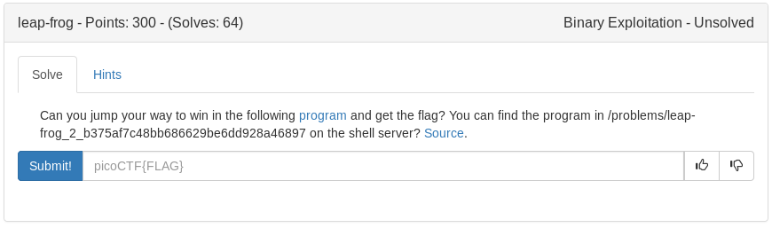

# Leap_frog (Binary)



Based on the title, clues and binary name it looks like we will be using Return Oriented Programming. My plan is to find the buffer needed to control EIP, then either find a win function or use system and /bin/sh to print the flag.

<details>
	<summary>Source Code</summary>

```c
#include <stdio.h>
#include <stdlib.h>
#include <string.h>
#include <unistd.h>
#include <sys/types.h>
#include <stdbool.h>


#define FLAG_SIZE 64

bool win1 = false;
bool win2 = false;
bool win3 = false;

void leapA() {
  win1 = true;
}

void leap2(unsigned int arg_check) {
  if (win3 && arg_check == 0xDEADBEEF) {
    win2 = true;
  }
  else if (win3) {
    printf("Wrong Argument. Try Again.\n");
  }
  else {
    printf("Nope. Try a little bit harder.\n");
  }
}

void leap3() {
  if (win1 && !win1) {
    win3 = true;
  }
  else {
    printf("Nope. Try a little bit harder.\n");
  }
}

void display_flag() {
  char flag[FLAG_SIZE];
  FILE *file;
  file = fopen("flag.txt", "r");
  if (file == NULL) {
    printf("'flag.txt' missing in the current directory!\n");
    exit(0);
  }

  fgets(flag, sizeof(flag), file);
  
  if (win1 && win2 && win3) {
    printf("%s", flag);
    return;
  }
  else if (win1 || win3) {
    printf("Nice Try! You're Getting There!\n");
  }
  else {
    printf("You won't get the flag that easy..\n");
  }
}

void vuln() {
  char buf[16];
  printf("Enter your input> ");
  return gets(buf);
}

int main(int argc, char **argv){

  setvbuf(stdout, NULL, _IONBF, 0);
  
  // Set the gid to the effective gid
  // this prevents /bin/sh from dropping the privileges
  gid_t gid = getegid();
  setresgid(gid, gid, gid);
  vuln();
}
```
</details>

leapA() = win1 to true
leap2(arg1) = win2 to true IF win3 is true and arg1 is 0xDEADBEEF
leap3() = win3 to true if win1 is true and win1 is not true??? Confusing...

if win1/win2/win3 are true and we return to display_flag we should get the flag printed

Lets start by finding our offset which should be close to 16 according to the sourcecode


**pwn cyclic 50 | strace ./rop**
```
read(0, "aaaabaaacaaadaaaeaaafaaagaaahaaa"..., 4096) = 50
read(0, "", 4096)                       = 0
--- SIGSEGV {si_signo=SIGSEGV, si_code=SEGV_MAPERR, si_addr=0x61616168} ---
+++ killed by SIGSEGV +++
Segmentation fault
```
**pwn cyclic -l 0x61616168**
``
28
``

