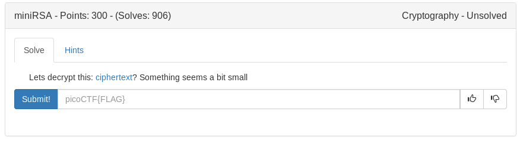

# MiniRSA (Crypto)



Small E (3) Lets use Hastads broadcast attack (link:https://www.rootnetsec.com/picoctf-2018-safe-rsa/)

```python
#!/usr/bin/env python

import gmpy

n = 29331922499794985782735976045591164936683059380558950386560160105740343201513369939006307531165922708949619162698623675349030430859547825708994708321803705309459438099340427770580064400911431856656901982789948285309956111848686906152664473350940486507451771223435835260168971210087470894448460745593956840586530527915802541450092946574694809584880896601317519794442862977471129319781313161842056501715040555964011899589002863730868679527184420789010551475067862907739054966183120621407246398518098981106431219207697870293412176440482900183550467375190239898455201170831410460483829448603477361305838743852756938687673

e = 3

c = 2205316413931134031074603746928247799030155221252519872650082343781881947286623459260358458095368337105247516735006016223547924074432814737081052371203373104854490121754016011241903971190586239974732476290129461147622505210058893325312869

gs = gmpy.mpz(c)
gm = gmpy.mpz(n)
g3 = gmpy.mpz(e)
 
mask = gmpy.mpz(0x8080808080808080808080808080808080808080808080808080808080808080808080808080808080808080808080808080808080808080808080808000)
test = 0
while True:
  if test == 0:
   gs = gs
  else:
   gs += gm
  root,exact = gs.root(g3)
  if (root & mask).bit_length() < 8:
    print root
    break

print '\n',hex(int(root))[2:-1].decode('hex')
```

<details>
	<summary>Flag</summary>

picoCTF{n33d_a_lArg3r_e_db48b19b}
</details>