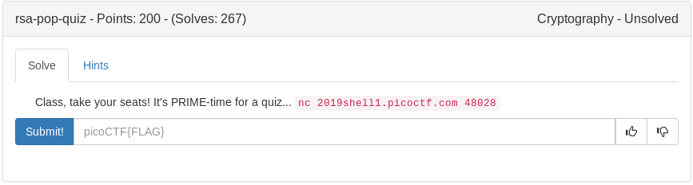

# RSA Pop Quiz (Crypto)



Several questions about basic RSA, easy but had fun scrpting it.

```python
#!/usr/bin/env python

from pwn import *
from Crypto.Util.number import *

#connect
r = remote('2019shell1.picoctf.com', 48028)


#first
p = 0
n = 0
q = 0
r.recvuntil('q : ')
q = int(r.recvuntil('\n'), 10)
r.recvuntil('p : ')
p = int(r.recvuntil('\n'), 10)
n = q*p
r.sendline('y')
r.sendline(str(n))

#second
p = 0
n = 0
q = 0
r.recvuntil('p : ')
p = int(r.recvuntil('\n'), 10)
r.recvuntil('n : ')
n = int(r.recvuntil('\n'), 10)
if n % p  == 0:
	q = n/p
	r.sendline('y')
	r.sendline(str(q))
else:
	r.sendline('n')

#third
r.sendline('n')

#fourth
p = 0
n = 0
q = 0
r.recvuntil('q : ')
q = int(r.recvuntil('\n'), 10)
r.recvuntil('p : ')
p = int(r.recvuntil('\n'), 10)
n = q*p
totient = (q-1)*(p-1)
r.sendline('y')
r.sendline(str(totient))

#fifth
p = 0
n = 0
q = 0
totient = 0
r.recvuntil('plaintext : ')
m = int(r.recvuntil('\n'), 10)
r.recvuntil('e : ')
e = int(r.recvuntil('\n'), 10)
r.recvuntil('n : ')
n = int(r.recvuntil('\n'), 10)
c = pow(m, e, n)
r.sendline('y')
r.sendline(str(c))

#sixth
p = 0
n = 0
q = 0
totient = 0
d = 0
c = 0
r.recvuntil('ciphertext : ')
c = int(r.recvuntil('\n'), 10)
r.recvuntil('e : ')
e = int(r.recvuntil('\n'), 10)
r.recvuntil('n : ')
n = int(r.recvuntil('\n'), 10)
r.sendline('n')

#seventh
p = 0
n = 0
q = 0
totient = 0
d = 0
c = 0
r.recvuntil('q : ')
q = int(r.recvuntil('\n'), 10)
r.recvuntil('p : ')
p = int(r.recvuntil('\n'), 10)
r.recvuntil('e : ')
e = int(r.recvuntil('\n'), 10)
n = q*p
totient = (q-1)*(p-1)
d = inverse(e, totient)
r.sendline('y')
r.sendline(str(d))

#eighth
p = 0
n = 0
q = 0
totient = 0
d = 0
c = 0
r.recvuntil('p : ')
p = int(r.recvuntil('\n'), 10)
r.recvuntil('ciphertext : ')
c = int(r.recvuntil('\n'), 10)
r.recvuntil('e : ')
e = int(r.recvuntil('\n'), 10)
r.recvuntil('n : ')
n = int(r.recvuntil('\n'), 10)
q = n/p
totient = (p-1)*(q-1)
d = inverse(e, totient)
m = pow(c, d, n)
r.sendline('y')
r.sendline(str(m))
print hex(m)[2:].decode('hex')
```

<details>
	<summary>Flag</summary>
	
picoCTF{wA8_th4t$_ill3aGal..o1cae2547}
</details>