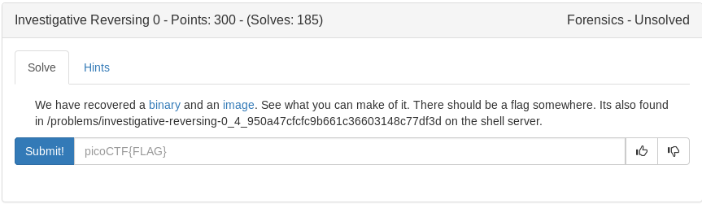
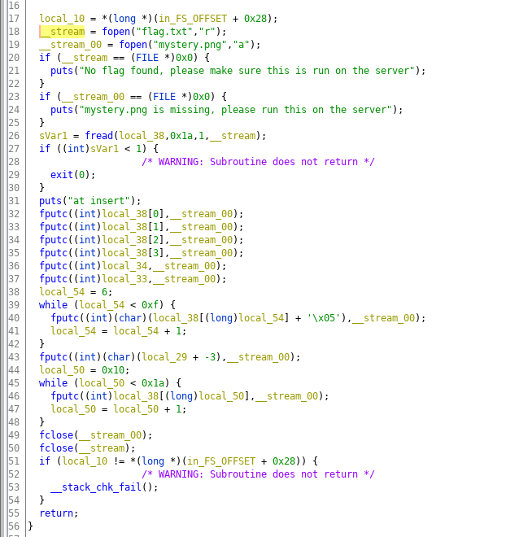

# Investigative Reversing (Forensics)



Exploring the .png theres data at the end:

```
picoCTK.k5zsid6q_5266a857}
```

Using ghidra we can see the elf binary is taking input from flag then changing it and outputting to the end of the .png so lets write a simple script to reverse the modifications



```python
#!/usr/bin/env python

og = 'picoCTK.k5zsid6q_5266a857}'

flag = 'picoCT'

second = 'K.k5zsid6q'

third = og[16:26]
for i in second:
	flag+= chr(ord(i)-0x5)

flag+= third

print flag
```

not sure why the flag printed weird but I could guess the rest of it

```
picoCTF)f0und_1l_5266a857}
```

<details>
	<summary>Flag</summary>

picoCTF{f0und_1t_5266a857}
</details>