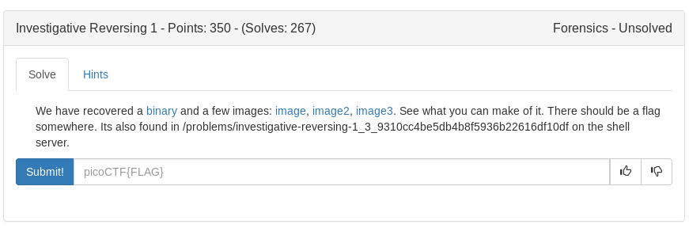

# Investigative Reversing (Forensics)



I got the source from ghidra and slowly worked through this one as I wrote the below python script. There were some characters I could not output but luckily they were easy to guess so I just hard coded them to the correct flag position

```python
#!/usr/bin/env python

from pwn import *

pic1 = 'CF{An1_7fc02786}'
pic2 = '.s'
pic3 = 'icT0tha_'
var1 = ['a']
pic1_c = 0
pic2_c = 0
pic3_c = 0

flag = []
for i in range(26):
	flag.append('a')

flag[1] = pic3[pic3_c]
pic3_c+=1

flag[0] = 'p'

flag[2] = pic3[pic3_c]
pic3_c+=1

flag[4] = pic1[pic1_c]
pic1_c+=1

flag[5] = pic3[pic3_c]
pic3_c+=1

var1 = 0

for i in range(6, 10):
	var1+=0x01
	flag[i] = pic1[pic1_c]
	pic1_c+=1

flag[3] = chr(ord(pic2[1])-var1)

for j in range(10, 0xf):
	flag[j] = pic3[pic3_c]
	pic3_c+=1

for k in range(0xf, 0x1a):
	flag[k] = pic1[pic1_c]
	pic1_c+=1

new_flag = ''

for i in flag:
	new_flag+= i
print new_flag
```

<details>
	<summary>Flag</summary>

picoCTF{An0tha_1_7fc02786}
</details>