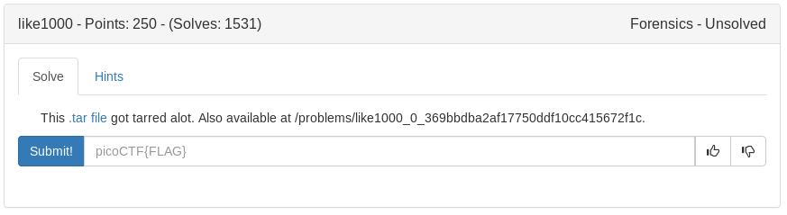

# 1000likes (Forensics)



From the hint it seemed pretty easy, wrote a script to make it easy.

```python
#!/usr/bin/env

import tarfile

for i in range(1000, 0, -1):
	tar = tarfile.open(str(i)+".tar")
	tar.extractall()
	tar.close()
```

```bash
eog flag.png
```

