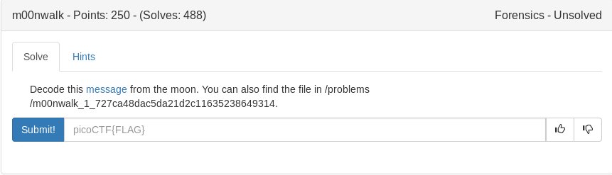

# m00nwalk (Forensics)

Based on the title and clues I started with audacity and QSSTV but I couldnt get the setup going properly. I ended up installing robot36 sstv on my phone with googleplay and playing the audio file there which produced a picture and the flag.

	
Flag

picoCTF{beep_boop_im_in_space}

