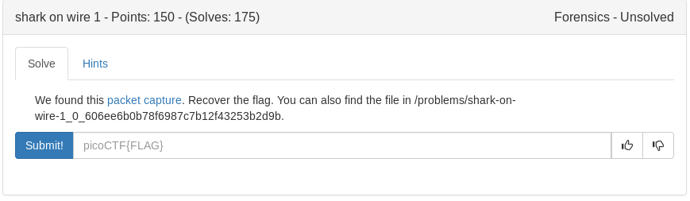

# Shark on Wire 1 (Forensics)



Based on the title and filename I assumed wireshark would be involved

```bash
wireshark capture.pcap
```

after poking through the pcap with wireshark i followed a udpstream that revealed the flag

<details>
	<summary>Flag</summary>

picoCTF{StaT31355_636f6e6e}
</details>
