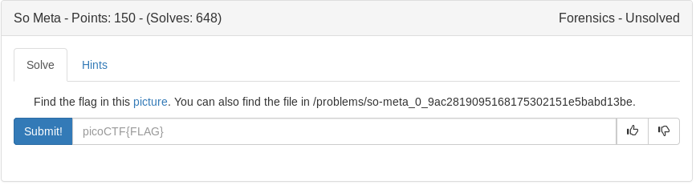

# So Meta (Forensics)



Presented with this picture:


Based on the title of the challenge lets try messing with exif and exiftools.

```bash
exiftool images/pico_img.png 
```

<details>
	<summary>Flag</summary>

picoCTF{s0_m3ta_74e57c5c}
</details>