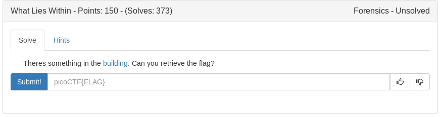

# What Lies Within (Forensics)



Picture:


Lets try low hanging fruit (strings, eog etc)
Nothing interesting

It's a png so lets use zsteg (very handy)

```bash
zsteg images/buildings.png
```

<details>
	<summary>Flag</summary>

picoCTF{h1d1ng_1n_th3_b1t5}
</details>