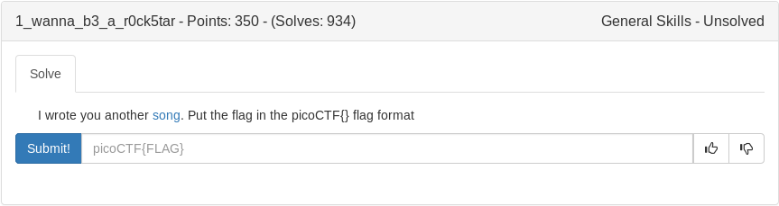

# 1_wanna_b3_a_r0ck5tar (General)



Our first test:

```
A guitar is a six-string        
Tommy's been down               
Music is a billboard-burning razzmatazz!
Listen to the music             
If the music is a guitar                  
Say "Keep on rocking!"
```

a guitar : a(1) six(3) string(6) so 136
listen to the music : readinput from user
if the music == a guitar : if the music == 136

So we enter 136 and it prints Say "Keep on rocking!"  

Next test:

```
Listen to the rhythm
If the rhythm without Music is nothing
```

Now up above we see that 

```
Music is a billboard-burning razzmatazz!
``` 

We need to make  music - the rhythm(user input) = 0
music = a(1) billboard(9) burning(7) razzmatazz(0)

So we input 0 and it prints 

66
79
78
74
79
86
73

Head to cyberchef and use "from decimal on the above numbers"

<details>
	<summary>Flag</summary>

picoCTF{BONJOVI}
</details>