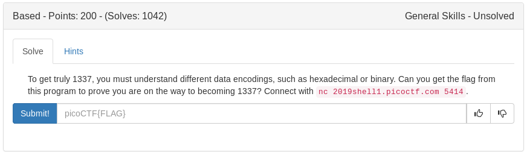

# Based (General)



Connect with:

```bash
nc 2019shell1.picoctf.com 5414
```

An easy challenge with cyberchef but i decided to script it with python for fun

```python
#!/usr/bin/env python

from pwn import *

p = remote('2019shell1.picoctf.com', 5414)

#first question
p.recvuntil('the ')
q = p.recvuntil('as')[:-2]
q = q.replace(' ', '')
ans = ''
for i in range((len(q)/9)+1):
	a = int(q[i*8:8+(i*8)], 2)
	ans+= chr(a)
p.sendline(ans)

#second question
p.recvuntil('the  ')
q = p.recvuntil('as')[:-2]
q = q.replace(' ', '')
ans = ''
for i in range((len(q)/3)):
	a = int(q[i*3:3+(i*3)], 8)
	ans+= chr(a)
p.sendline(ans)

#third question
p.recvuntil('the ')
q = p.recvuntil('as')[:-2]
ans = ''
for i in range(len(q)/2):
	a = int(q[i*2:2+(i*2)], 16)
	ans+= chr(a)
p.sendline(ans)

#win
p.recv()
print p.recv()
```

<details>
	<summary>Flag</summary>

picoCTF{learning_about_converting_values_6344dd5b}
</details>