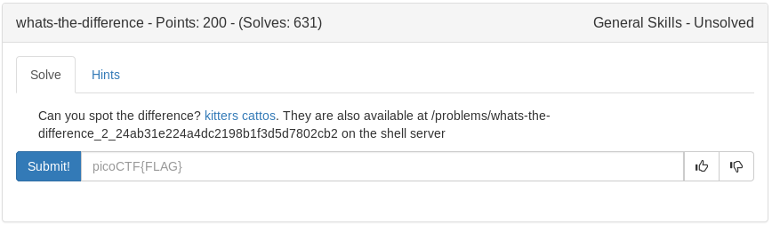

# Whats the Difference (General)



```bash
xxd kitters.jpg > kit.hex
xxd cattos.jpg > cat.hex
vimdiff kit.hex cat.hex
```

Just compared the two and kept track of the differences


<details>
	<summary>Flag</summary>

picoCTF{th3yr3_a5_d1ff3r3nt_4s_bu773r_4nd_j311y_aslkjfdsalkfslkflkjdsfdszmz10548}
</details>

