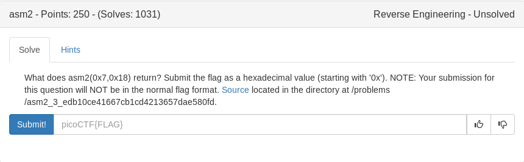

# asm2 (RE)



```python
#!/usr/bin/env python

# #What does asm2(0x7,0x18) return?

# asm2:
# 	<+0>:	push   ebp
# 	<+1>:	mov    ebp,esp
# 	<+3>:	sub    esp,0x10
# 	<+6>:	mov    eax,DWORD PTR [ebp+0xc]		#input2(0x18) into eax
# 	<+9>:	mov    DWORD PTR [ebp-0x4],eax		#eax(0x18) into var1
# 	<+12>:	mov    eax,DWORD PTR [ebp+0x8]		#input1(0x7) into eax
# 	<+15>:	mov    DWORD PTR [ebp-0x8],eax		#eax(0x7)into var2
# 	<+18>:	jmp    0x50c <asm2+31>				#jmp to asm2+31
# 	<+20>:	add    DWORD PTR [ebp-0x4],0x1
# 	<+24>:	add    DWORD PTR [ebp-0x8],0xcc
# 	<+31>:	cmp    DWORD PTR [ebp-0x8],0x3937   #compare var2(0x7) to 0x3937
# 	<+38>:	jle    0x501 <asm2+20>				#if less than or equal jump to asm2+20
# 	<+40>:	mov    eax,DWORD PTR [ebp-0x4]		#var1 to eax
# 	<+43>:	leave  
# 	<+44>:	ret    


var1 = 0x18
var2 = 0x7

while var2 <= 0x3937:
	var1+= 0x1
	var2+= 0xcc

print hex(var1)
```

<details>
	<summary>Flag</summary>

0x60
</details>