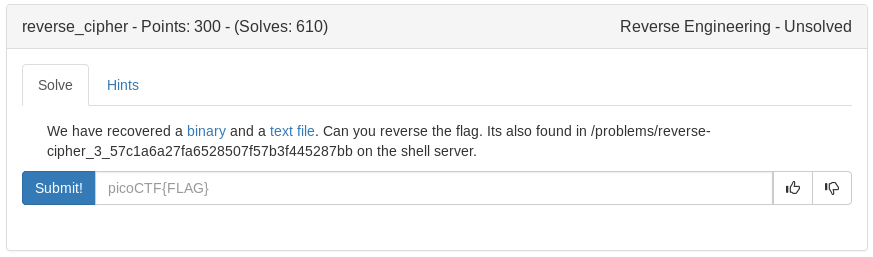

# Reverse Cipher (RE)



Heres the source taken from ghidra

<details>
	<summary>Source Code</summary>

```c

void main(void)

{
  size_t sVar1;
  char local_58 [23];
  char local_41;
  int local_2c;
  FILE *rev_this;
  FILE *flag;
  uint local_14;
  int local_10;
  char local_9;
  
  flag = fopen("flag.txt","r");
  rev_this = fopen("rev_this","a");
  if (flag == (FILE *)0x0) {
    puts("No flag found, please make sure this is run on the server");
  }
  if (rev_this == (FILE *)0x0) {
    puts("please run this on the server");
  }
  sVar1 = fread(local_58,0x18,1,flag);
  local_2c = (int)sVar1;
  if (local_2c < 1) {
                    /* WARNING: Subroutine does not return */
    exit(0);
  }
  local_10 = 0;
  while (local_10 < 8) {
    local_9 = local_58[(long)local_10];
    fputc((int)local_9,rev_this);
    local_10 = local_10 + 1;
  }
  local_14 = 8;
  while ((int)local_14 < 0x17) {
    if ((local_14 & 1) == 0) {
      local_9 = local_58[(long)(int)local_14] + '\x05';
    }
    else {
      local_9 = local_58[(long)(int)local_14] + -2;
    }
    fputc((int)local_9,rev_this);
    local_14 = local_14 + 1;
  }
  local_9 = local_41;
  fputc((int)local_41,rev_this);
  fclose(rev_this);
  fclose(flag);
  return;
}
```
</details>

Lets disect the code

flag.txt and rev_this are loaded into 2 variables(which ive renamed in the source)

The next interesting part is 0x18 bytes from the flag are loaded into a variable

Next the first 8 characters, likely 'picoCTF{', are printed to rev_this. We can verify this by cat'ing the rev_this file

```
picoCTF{w1{1wq84>654f26}
```

The next for loop we will subtract 0x5 or add +2 to the character based on if its an odd number or not. I wrote a script for this that prints the flag at the end

```python
#!/usr/bin/env python

flag = 'picoCTF{w1{1wq84>654f26}'
new_flag = ''
for i in range(8):
	new_flag+= flag[i]
for i in range(8, 23):
	if i % 2 == 0:
		new_flag+= chr(ord(flag[i])-0x5)
	else:
		new_flag+= chr(ord(flag[i])+2)
print new_flag+'}'
```

<details>
	<summary>Flag</summary>

picoCTF{r3v3rs369806a41}
</details>