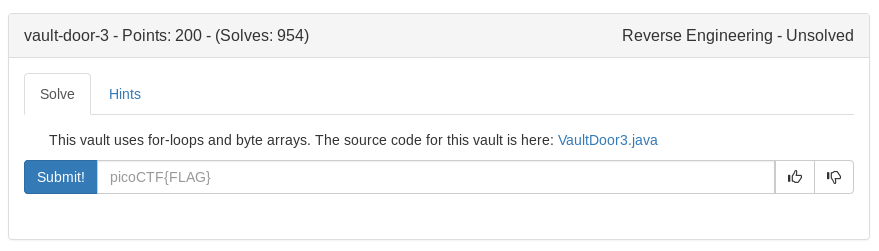

# Vault Door 3 (RE)



Looks like this is just a flag scrambled with a java script

First 8 characters are not changed:

```
jU5t_a_s
```

Next 8 are reversed

```python
>>> a = 'na_3lpm1'
>>> print a[::-1]
1mpl3_an
```
The next couple are sorta complicated (reverse every other number then take every other number backwards) So I just ended up writing a python script

```python
flag = 'jU5t_a_sna_3lpm16g84c_u_4_m0r846'
buf = []
for i in range(32):
	buf.append('a')
for i in range(8):
	buf[i] = flag[i]
for i in range(8, 16):
	buf[i] = flag[23-i]
for i in range(16, 32, 2):
	buf[i] = flag[46-i]
for i in range(31, 16, -2):
	buf[i] = flag[i]
buf = "".join(buf)
print 'picoCTF{'+buf+'}'
```

<details>
	<summary>Flag</summary>

picoCTF{jU5t_a_s1mpl3_an4gr4m_4_u_c08866}
</details>