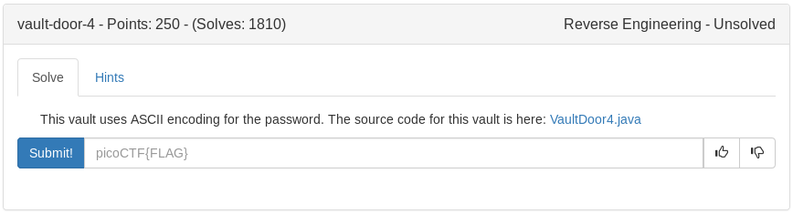

# Vault Door 4 (RE)

Take each row of numbers and decode them in the following order in cyberchef

from decimal
from hex
from octal
do not code

the result is the flag

	
Flag

picoCTF{jU5t_4_bUnCh_0f_bYt3s_7a1c8c668b}

