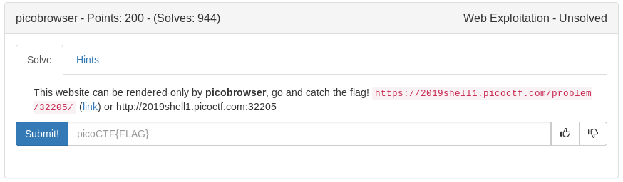

# Picobrowser (Web)



Exploring the site, says we're not picobrowser, let curl handle it

```bash
curl -A picobrowser http://2019shell1.picoctf.com:32205/flag
```

<details>
	<summary>Flag</summary>

picoCTF{p1c0_s3cr3t_ag3nt_665ad8a4}
</details>