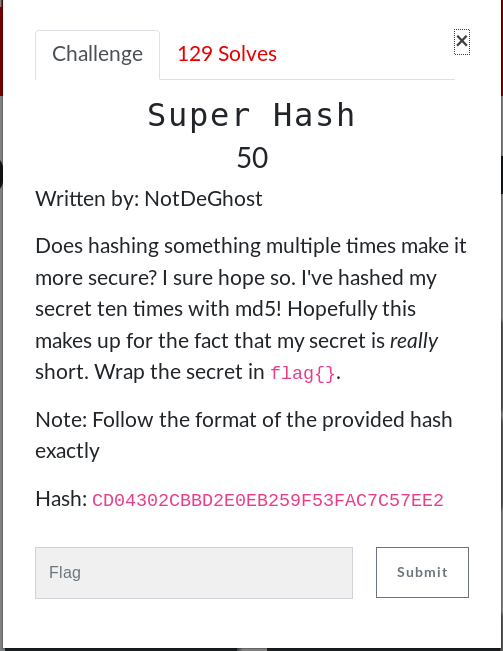

# Super Hash (Crypto)



## Walkthrough

Given the clue that the flag is very small we can brute force with the following script:

```python
#!/usr/bin/env python

import string
import hashlib

cipher = "CD04302CBBD2E0EB259F53FAC7C57EE2"

for i in string.printable:
	m = hashlib.md5(i).hexdigest().upper()
	for j in range(9):
		m = hashlib.md5(m).hexdigest().upper()
		if m == cipher:
			print i
```

<details>
	<summary>Flag</summary>

The character md5'd 10 times is '^' so our flag is flag{^}
</details>