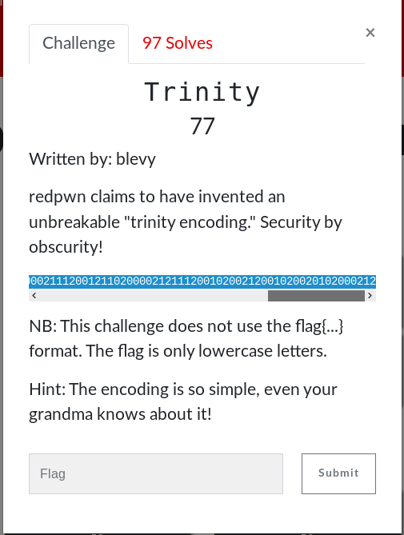

# Trinity (Crypto)

## Walkthrough

We are given the string **1202010210201201021011200200021121112010202012010210102012102021000200121200210002021210112111200121200002111200121102000021211120010200212001020020102000212**

0 = .
1 = -
2 = space

Lets make the changes

- . .-. -. .- .-. -.-- .. ... -- --- .-. . .- .-. -.-. .- -. . -... ..- - .. -... . - -.-- --- ..- - .... --- ..- --. .... - --- ..-. .. - ..-. .. .-. ... - 

Plug that into a morse code decoder and we get our flag

	
Flag

ternaryismorearcanebutibetyouthoughtofitfirst

