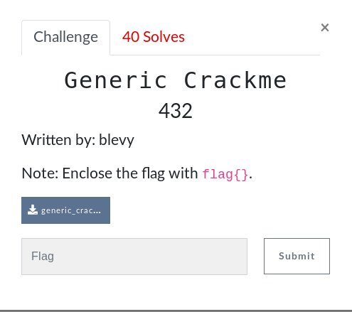

# Generic Crackme (Reverse)



## Initial Thoughts

* open with ghidra and figure out what password it is
* write a simple script to subtract 1 from each hex character and see if it works

```python
#!/usr/bin/env python

from pwn import *

p = process('./generic_crackme')
print p.recv()
payload = chr(0x65-1)
payload+= chr(0x70-1)
payload+= chr(0x68-1)
payload+= chr(0x68-1)
payload+= chr(0x7a-1)
p.sendline(payload)
p.recv()
print 'Password is: '+payload
```
<details>
	<summary>Flag</summary>

flag{doggy}
</details>