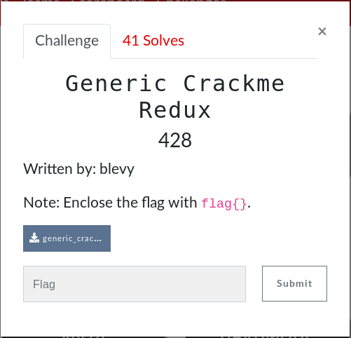

# General Crackme Redux (Reverse)



## Initial Thoughts

Similar to the last one I booted up with Ghidria and noticed a bitwise operation:

```c
ulong FUN_00101169(int iParm1)

{
  return (ulong)(iParm1 * 10 & 0xffffff00U | (uint)(iParm1 * 10 == 0xac292));
}
```
Working in reverse i tried
```python
0xac292/10
```
which gave me the flag