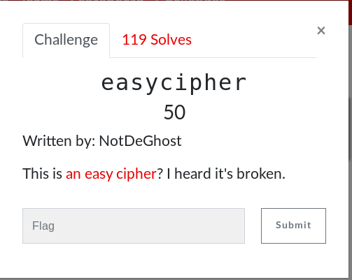

# EasyCipher (Web)



## Walkthrough

Looks like some type of script is being ran when I try to enter the password so I used curl to grab what it was

```bash
curl http://chall.2019.redpwn.net:8006/ > output.txt
```

This returns an output that shows the script as it md5 hashes the password and checks the user input against that

```
if(calcMD5(prompt(_0x29a9[5]))=== _0x29a9[6]){alert(_0x29a9[7])}else {alert(_0x29a9[8])}
```

looking for **0x29a9[7]** we can find that it is the hex equivalent of the password which acts as the flag...

<details>
	<summary>Flag</summary>

flag{shazam}
</details>