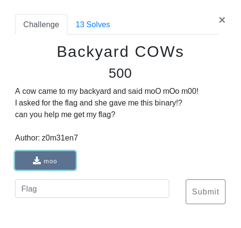

# Backyard COWs (Binary/RE)



## Walkthrough

Loading the binary in ghidra we can see the program is checking for the hex **0x341** which gives us the number 13337

Lets try that in the program

```
 ____________________________
< moo! select your language! >
 ----------------------------
        \   ^__^
         \  (oo)\_______
            (__)\       )\/\
                ||----w |
                ||     ||
1. English
2. My Native Language

Your choice: 1
give me a number
13337
moo moo moo!!
http://bit.ly/m00_m00
```

Follow the link and we get a bunch of MOOOO text, probably some esoteric language which we can put into http://tio.run . Sure enough theres a COW language that outputs the flag

<details>
	<summary>Flag</summary>

secarmy{d0_y0u_l1k3_c0w_languag3____?}
</details>