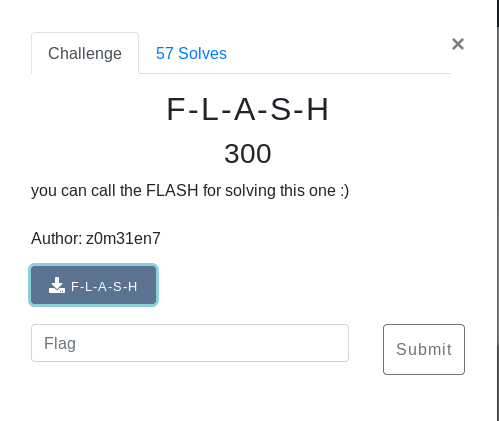
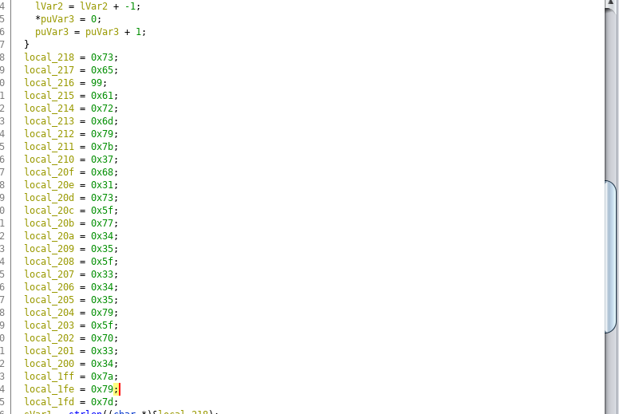

# F-L-A-S-H (Binary/RE)



## Walkthrough

Load up the binary in ghidra we notice an interesting set of hex



Lets cut it up and throw it in cyber chef using the from hex option
```
  73
  65
  63
  61
  72
  6d
  79
  7b
  37
  68
  31
  73
  5f
  77
  34
  35
  5f
  33
  34
  35
  79
  5f
  70
  33
  34
  7a
  79
  7d
```

<details>
	<summary>Flag</summary>

secarmy{7h1s_w45_345y_p34zy}
</details>