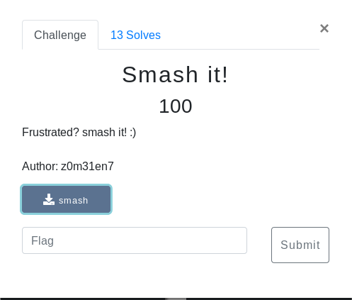

# Smash It (Binary/RE)



## Walkthrough

Smash it? Sounds like an overflow...

```bash
pwn cyclic 300 | strace ./Smash
```

<details>
	<summary>Flag</summary>
	
secarmy{sm@sh1ng_st@ck_1s_t00_much_fun}
</details>