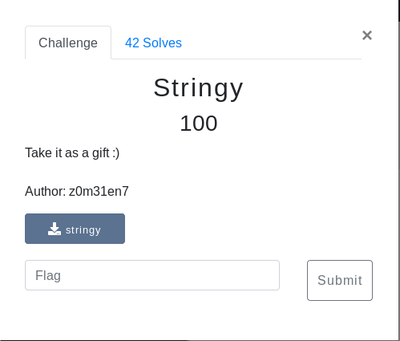

# Stringy (Binary/RE)



## Walkthrough

Stringy....lets check the low hanging fruit (ltrace, strace, strings)

strings gave us some interesting stuff:

```
c2VjYXJt
eXtsMDBr
X2E3X3Ro
M19zdHIx
bmc1ISF9
```

base64 -d'ing each of those pieces gives us the flag

```bash
echo "c2VjYXJteXtsMDBrX2E3X3RoM19zdHIxbmc1ISF9" | base64 -d
```

<details>
	<summary>Flag</summary>

secarmy{l00k_a7_th3_str1ng5!!}
</details>